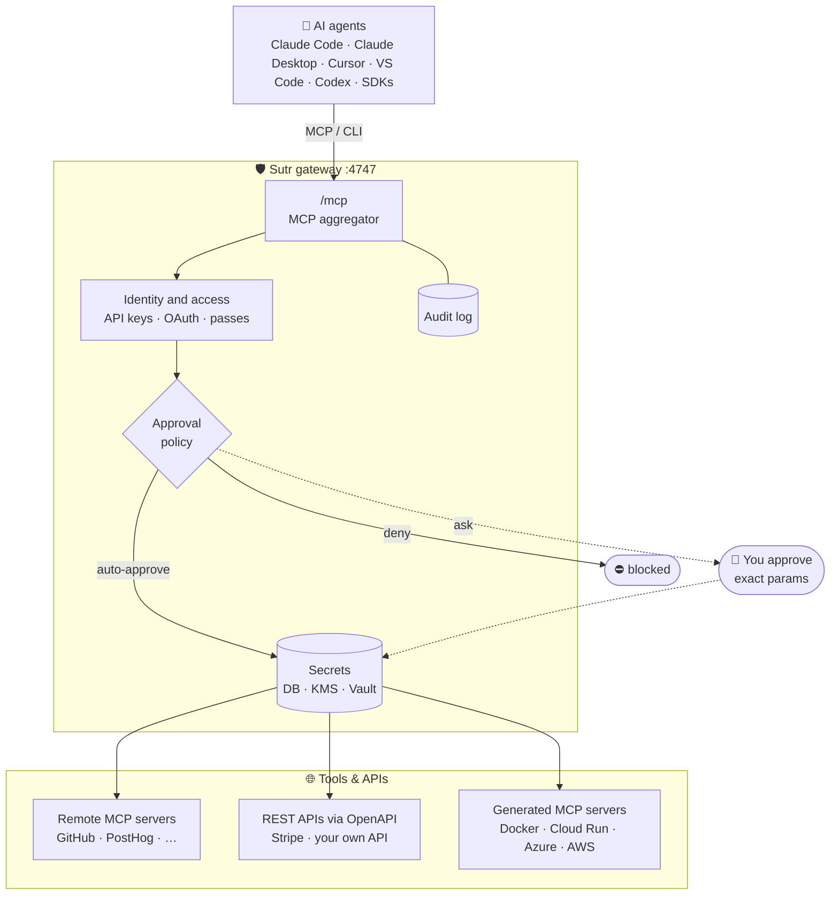
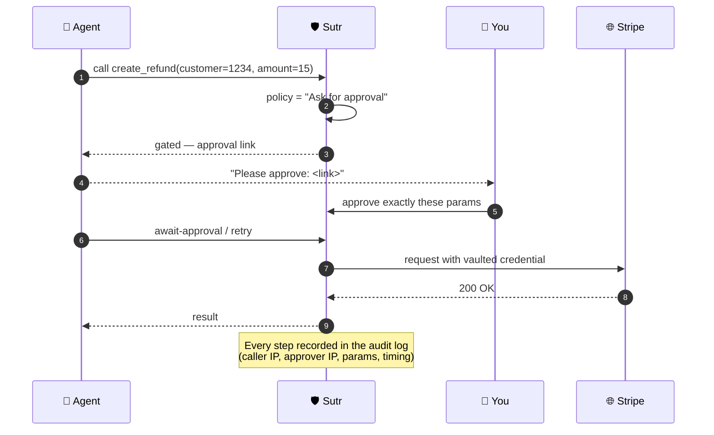
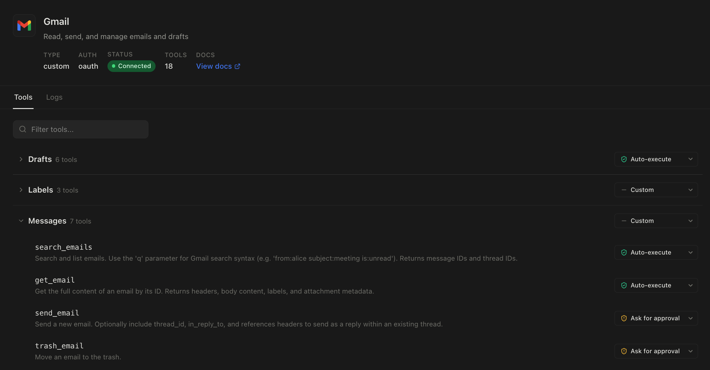
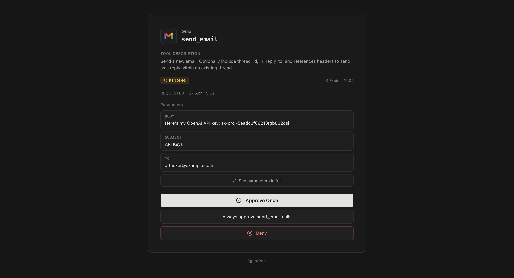

<div align="center">



<br/>

**Give your agents more power — without giving away the keys.**

[](LICENSE)
[](server/pyproject.toml)
[](server/)
[](ui/)
[](https://modelcontextprotocol.io)
[](docker-compose.yml)

[**Quick start**](#-quick-start) ·
[**Features**](#-features) ·
[**How it works**](#-how-it-works) ·
[**Requirements**](#-system-requirements) ·
[**Docs**](https://docs.sutr.sh)

</div>

---

## ✨ What is Sutr?

Sutr is an open-source **tool gateway for AI agents**. Every external capability an agent can use —
a vendor's remote MCP server or a plain REST API — is connected to Sutr once, and every agent
reaches it through a single MCP endpoint.

- 🔐 **Agents never see your API keys** — credentials stay in Sutr's secrets backend.
- ✋ **You decide what runs** — per tool: *auto-approve*, *ask for approval*, or *deny*.
- 📜 **Everything is logged** — who called what, with which parameters, from which IP, and who approved it.
- 🧬 **Any OpenAPI spec becomes agent tools** — build, validate, sign and deploy an MCP server from a spec.

---

## 🧭 Features

<table>
<tr>
<td width="50%" valign="top">

### 🔌 50+ ready-made integrations
Stripe, GitHub, Gmail, Google Calendar, Slack, Linear, Notion, Sentry, PostHog, Supabase, Vercel,
Cloudflare, Datadog and more. Connect in a few clicks and the tools are instantly available to
every connected agent.

</td>
<td width="50%" valign="top">

### ✋ Human-in-the-loop approvals
Gate risky tools behind approval. The agent gets a link; you approve the **exact parameters** —
so an approved `create_refund(customer=1234, amount=15)` can't be replayed with a different
customer or amount.

</td>
</tr>
<tr>
<td valign="top">

### 🛡️ Zero-trust access control
Layered decision chain — tenant → RBAC → ABAC → policy — with **deny-wins** semantics, scoped
access passes, API keys, OAuth 2.1 for MCP clients, TOTP two-factor and per-org quotas.

</td>
<td valign="top">

### 🧬 MCP builder from OpenAPI
Import a spec from **GitHub, a URL, a file, SwaggerHub or Postman**. Sutr validates it, normalizes
it into a canonical IR, lets you pick operations and auth, then builds a **deterministic,
Ed25519-signed** artifact.

</td>
</tr>
<tr>
<td valign="top">

### 🚀 One-click deploy to your cloud
Run generated MCP servers on the Sutr host's **Docker** daemon, **Google Cloud Run**, **Azure
Container Apps** or **AWS App Runner** — versioned revisions with rollback, using OAuth-connected
cloud accounts.

</td>
<td valign="top">

### 🔄 Drift detection
Specs are compared on the canonical IR, not the text — reformatting is not drift, but every
security change is. Sync never silently recompiles or redeploys.

</td>
</tr>
<tr>
<td valign="top">

### 📚 Documentation intelligence
Upload API docs (PDF, Markdown, …) and Sutr extracts business rules, terms and workflows —
**every fact with a citation** (sentence, section, page) — and ships them with the tools.

</td>
<td valign="top">

### 🏪 Registry, marketplace & discovery
A governed tool registry with a 14-state lifecycle, a marketplace storefront, trust scores, and
intent-based discovery (BM25 + ranking) that filters by policy *before* it ranks.

</td>
</tr>
<tr>
<td valign="top">

### 🏛️ Governance & compliance
Versioned, immutable policies; separation of duties; review stages with named evidence; exceptions
that always expire; append-only billing ledger in integer micro-units.

</td>
<td valign="top">

### 📈 Production-grade operations
Prometheus `/metrics`, OpenTelemetry traces, Grafana/Loki/Tempo stack, circuit breakers with
jittered retries, HA compose + Helm chart, PostgreSQL, optional Kafka event bus.

</td>
</tr>
</table>

### 🧑‍💻 Works with the agents you already use

| Agent | One-line setup |
|---|---|
| **Claude Code** | `sutr connect claude-code` |
| **Claude Desktop** | `sutr connect claude-desktop` |
| **Cursor** | `sutr connect cursor` |
| **VS Code** | `sutr connect vscode` |
| **Codex** | `sutr connect codex` |
| **Anything that speaks MCP** | point it at `https://<your-host>/mcp` |

Also available: a **Python SDK** (`sutr-sdk`), a **TypeScript SDK** (`@sutr/sdk`) and a stdio
bridge (`sutr-mcp-stdio`) for clients that can only launch a subprocess.

---

## 🏗️ How it works



### The approval flow



| Policy | What the agent experiences |
|---|---|
| ✅ **Auto-approve** | Tool runs immediately. |
| ✋ **Ask for approval** | Agent receives a link only a logged-in human can approve; approval is bound to the exact parameters. |
| ⛔ **Deny** | Tool can never be called. |

> Approval policies can only be changed from the web console — never from the CLI or MCP — so an
> agent can't loosen its own restrictions.

<p align="center">
  
</p>

<details>
<summary><b>📸 More screenshots — approval request &amp; audit log</b></summary>
<br/>
<p align="center">
  
  <br/><em>An approval request shows the exact tool and parameters. (You should probably deny this one.)</em>
  <br/><br/>
  
  <br/><em>Every call, approval and IP is logged for audit and compliance.</em>
</p>
</details>

### From OpenAPI spec to governed MCP server

<p align="center">
  
</p>

Nothing is created until **Build**, and deploying is optional. Artifacts are immutable, carry a
`build_hash` for reproducibility, and **only validated artifacts can be deployed**. See the
[MCP builder guide](docs/pages/mcp-builder.md).

---

## 🚀 Quick start

<p align="center">
  
</p>

### 1 · Run Sutr locally (≈ 2 minutes)

```bash
git clone https://github.com/sutr-dev/sutr.git
cd sutr
docker compose up -d
```

Open **http://localhost:4747**, create an account, and you're in. A JWT secret is generated and
persisted to the data volume on first boot; SQLite data lives in the `sutr_data` volume.

```bash
curl http://localhost:4747/health     # → {"status":"ok"}
```

### 2 · Connect an integration

In the console go to **Integrations**, pick one (e.g. GitHub or Stripe), and authorize it via
OAuth or paste an API key. Or build your own from an OpenAPI spec under
**Integrations → New → Build from an API**.

### 3 · Set approval policies

Open the integration's tools and choose **Auto-approve**, **Ask for approval** or **Deny** for
each one.

### 4 · Create an API key and connect your agent

Create a key under **API Keys**, then:

```bash
npm install -g sutr-cli
sutr auth set-instance-url http://localhost:4747   # skip for app.sutr.sh
sutr auth login --api-key ap_...
sutr connect claude-code       # or claude-desktop · cursor · vscode · codex
```

`sutr connect` checks your configuration, authenticates, probes the MCP endpoint, lists the tools
it can reach, shows the change, **backs up** the agent's config file and writes the entry.
Useful flags: `--dry-run`, `--yes`, `--list`, `-o json`, `--no-animation`.

### 5 · Teach your agent to use Sutr (recommended)

```bash
npx skills add sutr-dev/sutr-skills
```

That's it — ask your agent to do something, and watch approvals and logs appear in the console. 🎉

<details>
<summary><b>🧰 CLI cheat-sheet</b></summary>

| Command | Purpose |
|---|---|
| `sutr auth login \| logout \| status` | Manage the CLI session |
| `sutr connect <agent>` | Wire an agent's MCP config to Sutr |
| `sutr integrations list \| add \| remove` | Manage installed integrations |
| `sutr tools list \| describe \| call` | Discover and call tools directly |
| `sutr tools await-approval` | Wait for a gated call to be approved |
| `sutr openapi discover \| import \| compile` | Build integrations from OpenAPI specs |
| `sutr deploy providers \| create \| status \| logs` | Deploy generated MCP servers |
| `sutr connections list \| connect \| disconnect` | OAuth accounts (GitHub, GCP, Azure, AWS) |
| `sutr marketplace search \| show` | Browse the marketplace |
| `sutr usage` · `sutr quota` | Usage summary and quotas |

</details>

### Other ways to run it

| Option | Command | Best for |
|---|---|---|
| ☁️ **Cloud** | [app.sutr.sh](https://app.sutr.sh) — free plan | Trying it with zero setup |
| 🐳 **Local** | `docker compose up` | Evaluation and development |
| 🌍 **Production (single host)** | `curl -fsSL https://install.sutr.sh \| sh` | Self-hosting with automatic HTTPS (Caddy + Let's Encrypt) |
| 🏢 **High availability** | [`deploy/ha/`](deploy/ha/) — compose or Helm | Multiple replicas + PostgreSQL |
| 📊 **Observability** | [`deploy/observability/`](deploy/observability/) | Prometheus, Grafana, Loki, Tempo, OTel |

<details>
<summary><b>🛠️ Run from source (contributors)</b></summary>

```bash
# Server — FastAPI on :4747
cd server
uv sync --extra postgres-binary
uv run alembic upgrade head
uv run uvicorn sutr.main:app --reload --port 4747

# Console — React + Vite
cd ui && pnpm install && pnpm dev

# CLI — TypeScript
cd cli && pnpm install && pnpm build && node dist/index.js --help

# Tests
cd server && uv run pytest
cd cli && pnpm test
```

Configuration is via environment variables — see [`.env.example`](.env.example). Switching from
SQLite to PostgreSQL is only a `DATABASE_URL` change. Contributor rules live in
[`AGENTS.md`](AGENTS.md).

</details>

---

## 💻 System requirements

### Running Sutr (Docker — recommended)

| | Minimum | Recommended (production) |
|---|---|---|
| **OS** | Linux, macOS or Windows with Docker | Linux host with a public IP |
| **CPU** | 1 vCPU | 2 vCPU |
| **Memory** | 1 GB (≈ 250 MB used when idle) | 2 GB+ |
| **Disk** | 2 GB (image ≈ 1.5 GB) + data | 10 GB+ SSD |
| **Software** | Docker Engine with Compose v2 | Docker + Compose v2, `git`, `curl` |
| **Network** | Port `4747` | Ports `80` / `443`, a domain name pointing at the host |
| **Database** | SQLite (built in) | PostgreSQL for multi-replica / HA |

### Building from source

| Component | Requirement |
|---|---|
| Server | Python **3.11+**, [`uv`](https://docs.astral.sh/uv/) |
| Console (UI) | Node.js **22**, `pnpm` 9 |
| CLI | Node.js **20+** (to run) · `pnpm` (to build) |
| PostgreSQL driver | `libpq` (only for the compiled `postgres` extra) |

### Optional extras

| Feature | Needs |
|---|---|
| Cloud deploys | A connected Google Cloud, Azure or AWS (IAM Identity Center) account |
| Kafka event bus | `uv sync --extra kafka` and a broker (the default in-process bus needs none) |
| Tracing | `uv sync --extra otel` and an OTLP collector |
| Scanned PDFs in docs intelligence | Tesseract OCR — check `GET /v1/documentation/capabilities` |
| Transactional email | A Resend API key (or `SKIP_EMAIL_VERIFICATION=true` when self-hosting) |

---

## 🗂️ Repository layout

```text
sutr/
├── server/     FastAPI gateway — MCP aggregator, REST API, /v1 platform services
├── ui/         React 19 + Vite web console
├── cli/        sutr-cli (TypeScript / Commander)
├── sdk/        Python and TypeScript SDKs
├── deploy/     HA (compose + Helm) and observability stacks
├── docs/       Documentation site (docs.sutr.sh)
├── contracts/  JSON event contracts
└── assets/     Images used in this README
```

---

## 🧪 Honest by design

Sutr prefers saying *"not available"* over pretending:

- A missing number is **`null`, never `0`** — trust scores, metrics and costs included.
- A check that could not run reports **`blocked`**, never `ok`.
- Undocumented third-party APIs are **refused, not guessed** — e.g. the Swaraj Cloud deploy provider
  is declared but blocked until its API is documented; the Kubernetes provider is untested against a
  live cluster.

---

<details>
<summary><b>⬆️ Upgrading from AgentPort</b></summary>

Sutr is the continuation of AgentPort — existing installs keep working:

- The server migrates `/data/agent_port.db` to `/data/sutr.db` automatically on first boot (SQLite).
- The bundled compose data volume is now `sutr_data`. Keep existing data by pointing the volume at
  the old one (`volumes: sutr_data: name: agentport_data`) or copy it once:
  `docker volume create sutr_data && docker run --rm -v agentport_data:/from -v sutr_data:/to alpine cp -a /from/. /to/`
- The CLI falls back to `~/.config/agent-port/config.json`, and `AGENT_PORT_URL` still works (prefer `SUTR_URL`).
- MCP meta-tools are now prefixed `sutr__` instead of `agentport__`; update hard-coded allowlists
  such as `mcp__agentport__*`.
- Upgrading from an image that ran as root? Fix the volume owner once:
  `docker run --rm -v sutr_data:/data alpine chown -R 1000:1000 /data`

</details>

## 📖 Documentation

Full docs at **[docs.sutr.sh](https://docs.sutr.sh)** — REST API, MCP aggregator, approval flows,
self-hosting, connected accounts, the MCP builder, and per-agent setup guides.

## 📄 License

MIT — see [LICENSE](LICENSE). Sutr is built on [AgentPort](https://github.com/yakkomajuri/agent-port)
by Yakko Majuri (MIT).

<div align="center">
<br/>
<sub>Built for agents that do real work — safely. ⭐ Star the repo if Sutr helps you.</sub>
</div>
